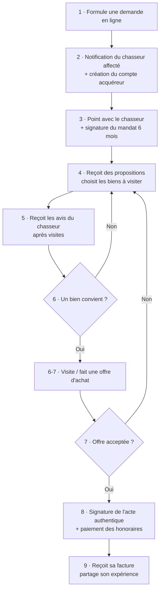
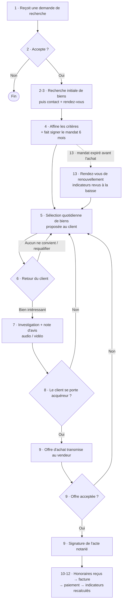

# TITRE


# 🏠 Projet fil rouge — Service de chasse immobilière

> **Titre visé :** Expert en informatique et systèmes d'information — **RNCP40573** (niveau 7)
> **Composition retenue :** les **3 blocs communs** (BC01, BC02, BC03) + le **bloc optionnel BC05** *« Construire et implémenter des modèles de big data et d'IA »*.
> **Bloc au cœur du projet :** **BC05**, appuyé par **BC01** (stratégie SI), **BC02** (piloter des projets) et **BC03** (concevoir & développer).
>
> Le titre RNCP40573 se valide avec **4 blocs : les 3 communs + 1 optionnel à choisir parmi 3** (BC04 cybersécurité, BC05 big data & IA, BC06 DevOps). L'option retenue ici est **BC05** ; BC04 et BC06 ne sont pas couverts par ce projet.

> 📌 **Boussole certificative.** Ce projet n'est pas un simple TP SQL : c'est une **mise en situation professionnelle reconstituée** au sens du RNCP40573. À chaque étape, sachez quelle compétence vous travaillez et quel livrable en fait la preuve. Deux documents vous servent de fil conducteur :
> * [`TRACABILITE-COMPETENCES.md`](./documents%20utiles/TRACABILITE-COMPETENCES.md) — la matrice compétence → étape → livrable ;
> * [`GRILLE-EVALUATION.md`](./documents%20utiles/GRILLE-EVALUATION.md) — le calibrage des livrables et la grille d'auto-évaluation.

> ⚠️ **Avertissement.** Cette entreprise, son organisation, ses données et ses personnages sont **entièrement fictifs**. Toute ressemblance avec une entreprise existante ou ayant existé, ou avec des personnes réelles, serait purement **fortuite**. Les données fournies sont des données de test générées pour l'exercice.

---

## Comment utiliser ce dépôt

Ce dépôt est votre point de départ. Voici comment vous y retrouver :

### Ce que contient le dépôt

```
Projet Fil rouge/
├── Readme.md              ← vous êtes ici : contexte, mission, livrables
├── fixtures/              ← les données de départ (l'existant à auditer)
│   ├── MySQL.sql          ← à jouer sur MariaDB/MySQL
│   ├── PgSQL.sql          ← à jouer sur PostgreSQL
│   └── Readme.md          ← comment importer, ce qui vous attend
└── documents utiles/      ← 📚 fiches de cours & modèles à remplir
    └── Readme.md          ← l'index de tous les documents
```

### 📚 Les documents utiles

Le dossier **[`documents utiles/`](./documents%20utiles/)** contient tout ce qu'il faut pour produire vos livrables : des **fiches de cours** (MCD/Merise, OLTP & OLAP, RACI, RGPD…) qui expliquent chaque notion, et des **modèles à remplir** (note de cadrage, matrice de décision, plan de tests, journal de décisions…). Commencez par son **[index](./documents%20utiles/Readme.md)**, qui range chaque document par usage, par phase et par bloc de compétences.

### Par où commencer

1. **Lisez ce Readme en entier** : contexte, parcours utilisateurs, mission en 4 phases, exigences transverses.
2. **Importez les fixtures** en suivant le [`Readme des fixtures`](./fixtures/Readme.md), et explorez l'existant.
3. **Ouvrez l'[index des documents utiles](./documents%20utiles/Readme.md)** et sa section « Comment démarrer ».
4. **Attaquez la Phase 1** (audit), puis avancez phase par phase.
5. **Tracez vos décisions** au fil de l'eau (voir le journal de décisions) : chaque choix devra être défendu à l'oral.

### Règles du jeu

* Les fichiers de **`fixtures/`** représentent l'existant : **ne les modifiez pas**, migrez à partir d'eux.
* Les **modèles** de `documents utiles/` se **dupliquent** dans vos propres fichiers ; ne remplissez pas les originaux.
* **Gardez des traces** de tout : c'est la matière de votre Dossier Professionnel et de la soutenance.
---

## Le contexte

Vous reprenez le SI d'une société de chasse immobilière : des particuliers font appel à cette entreprise pour leur trouver un bien immobilier à acquérir.

Une fois la demande déposée via le site web de l'entreprise, un chasseur est affecté au prospect qui signe alors avec le chasseur un mandat de recherche. Ce document légal a une validité de 6 mois renouvelable et peut être :

* **exclusif** : le chasseur est le seul chasseur à pouvoir agir pour le client ; même si le client trouve seul, le chasseur sera rémunéré
* **non-exclusif** : un autre chasseur (d'une autre agence) peut agir pour le compte du client avec un autre mandat non-exclusif ; si le client trouve seul : le chasseur pourra ne pas être rémunéré

Lors de la signature de l'acte authentique d'achat devant le notaire, l'entreprise collecte un montant fixe + un pourcentage du montant de l'achat. Ce montant, payé à part du montant d'achat par le client acheteur, sert de base de rémunération pour l'entreprise et les chasseurs. Réglé devant le notaire, qui est au courant qu'un mandat de recherche existe, ce montant est sécurisé par le notaire qui le collecte pour le compte de l'entreprise.

Le barème de rémunération du chasseur (sa part de ce que paye le client à l'entreprise) est variable dans le temps, suivant le montant du projet, et différent pour chaque chasseur (en fonction de leur ancienneté et de leur performance).

La performance est calculée suivant les critères suivants :

* délai entre la signature du mandat et l'achat effectif (acte authentique) arrondi à la semaine inférieure
* mandat exclusif ou non
* nombre de ventes réussies
* nombre de mandats signés
* nombre de visites avant achat (au moins il y en a, au plus la rémunération monte)

> **Constat de l'entreprise :** "_Il semblerait que, malgré le grand soin apporté lors de sa création, l'organisation actuelle de la base de données ne permette pas de gérer totalement nos besoins métiers._"

### Le parcours utilisateur actuel

#### Le particulier

1. le particulier formule une demande par le biais d'un formulaire en ligne
2. il reçoit une notification lui présentant quel chasseur va s'occuper de son besoin et l'invite à finaliser la création de son compte utilisateur sur l'espace acquéreur du site web de l'entreprise
3. le particulier effectue un premier point avec le chasseur pour préciser la recherche et signer le mandat de recherche
4. le particulier reçoit des propositions de biens de la part du chasseur et choisit les biens à visiter
5. le particulier reçoit les recommandations et avis du chasseur après que ce dernier ait effectué des visites des biens choisis
6. si aucun bien ne convient : retour au point 4, sinon le particulier est invité à visiter le bien / faire directement une offre d'achat
7. si l'offre n'est pas acceptée, retour au point 4, sinon la signature de l'acte authentique est organisée par le chasseur
8. signature de l'acte authentique et paiement des honoraires
9. le particulier reçoit sa facture et est invité à parler de son expérience + recevra des offres régulières de services.



#### Le chasseur

1. il reçoit une demande de recherche
2. il peut ne pas l'accepter ; s'il l'accepte, le système lui affiche le résultat d'une recherche initiale de biens correspondant à la recherche initiale.
3. il prend contact avec le prospect pour fixer un rendez-vous en présentiel ou en ligne
4. lors du rendez-vous, il affine les critères de recherche et présente des exemples de biens afin d'affiner plus encore et fait signer le mandat de recherche
5. chaque jour, voire plusieurs fois par jour dans les zones tendues, le système lui envoie une sélection de biens et il en fait une sélection à proposer à l'utilisateur
6. lorsque l'utilisateur a commenté et priorisé la sélection effectuée au point 5, il reçoit une alerte et peut alors soit engager les discussions ou visiter le bien, soit requalifier la recherche ; si aucun bien ne convient à l'utilisateur, on revient au point 5, sinon on passe au point 7
7. après avoir investigué sur des biens en particulier, le chasseur rédige une note d'avis, peut y joindre des commentaires audio et des vidéos
8. si le client souhaite se porter acquéreur, le système lui présente une offre d'achat à compléter et signer, déjà pré-remplie suivant les conclusions du chasseur effectuées au point 7 (montant de l'offre) ; dans le cas contraire : retour au point 5
9. le chasseur transmet l'offre d'achat au vendeur. Si elle est refusée, on retourne soit au point 8 pour en refaire une autre, soit au point 5. Si elle est acceptée, on prend rendez-vous pour organiser la signature de l'acte authentique chez le notaire.
10. une fois que l'entreprise reçoit les honoraires, le chasseur est prévenu du paiement proche de sa rémunération et de son montant, lui permettant de préparer sa facture.
11. lorsque le chasseur a envoyé sa facture dans le système, et une fois que le système l'affiche comme vérifiée et conforme, le paiement est affiché comme programmé
12. une fois le paiement effectué, la somme est marquée comme payée et les indicateurs de performance du chasseur sont recalculés et affichés
13. si on n'atteint pas le point 10 avant la fin de la validité du mandat de recherche (6 mois) le chasseur est invité à prendre rendez-vous avec l'acquéreur afin de renouveler le mandat. Les indicateurs de performance sont alors recalculés à la baisse et affichés au chasseur.



### Le futur de l'entreprise

Contre toute attente et malgré un SI et une organisation pour le moins "exotiques", l'entreprise tourne bien et gagne de l'argent. Il est prévu de racheter d'autres entreprises du même type afin d'étendre la couverture de recherche pour finir par couvrir toute la France, les DROMs et même l'Espagne, l'Allemagne, le Royaume-Uni, l'Irlande, le BeNeLux, l'Italie et la Suisse. Les projections les plus réalistes parlent de plusieurs milliers de mandats par semaine et de plusieurs centaines, voire milliers de biens répertoriés par recherche, en fonction des critères.

> **Constat de l'entreprise :** "_Il semblerait que, malgré le grand soin apporté lors de sa création, l'organisation actuelle de la base de données ne permette pas d'absorber les quantités de données prévues._"

### Le futur des besoins

Les projections concernant les futures demandes sont telles que des chasseurs-IA devront :

* épauler les chasseurs humains
* faire le travail dans les zones non couvertes physiquement par des chasseurs

> **Constat de l'entreprise :** "_Il semblerait que, malgré le grand soin apporté lors de sa création, l'organisation actuelle de la base de données ne permette pas d'y adjoindre une IA. Il paraîtrait que nos données ne sont pas organisées de la bonne manière ni avec la bonne technologie._"

#### Le futur du parcours utilisateur

##### Le particulier

1. inchangé + lorsque le formulaire de recherche est en cours de remplissage, le système donne des indicateurs de faisabilité du projet d'achat et incite l'utilisateur à affiner ou corriger sa recherche en fonction de la réalité du marché et des annonces disponibles
2. inchangé + reçoit une description rédigée en fonction du profil du vendeur et du sien, afin de renforcer l'impression d'avoir tapé à la bonne porte et que le chasseur va vraiment aider
3. inchangé
4. inchangé + chaque action du particulier (choisir, ou écarter un bien) va conduire à une proposition de modification de la recherche afin de prendre en compte les goûts du particulier
5. inchangé
6. inchangé
7. inchangé
8. inchangé
9. inchangé + offres et articles sélectionnés et rédigés par le système

#### Le chasseur

1. inchangé
2. inchangé + le système produit un rapport de faisabilité complet de la demande + indique au chasseur comment reformuler la demande afin de maximiser la réussite de la recherche
3. inchangé excepté que la prise de contact et de rendez-vous est automatisable
4. inchangé + l'affinage de la recherche est assisté par le système
5. inchangé + la sélection est dédoublonnée, les annonces sont comparées et pré-filtrées et ordonnées suivant la pertinence et les possibilités de faire une offre en dessous du prix sont pré-calculées
6. inchangé + la requalification pour écarter de la recherche les biens ressemblant aux biens écartés par le particulier est effectuée par le système automatiquement
7. inchangé + les avis sont pré-rédigés et assistés par le système
8. inchangé + le système peut proposer plusieurs offres, suivant les possibilités de jouer sur le prix (offre plus basse, au prix...)
9. inchangé + assistance du système ou automatisation
10. inchangé
11. inchangé + le système est autonome pour vérifier la facture
12. inchangé
13. inchangé + conseils de la part du système pour améliorer la recherche

### Le SI

Le SI est principalement composé de :

* une armoire à dossiers papier
* une base de données alimentée et requêtée par le site web pour les prospects (hors de votre scope) et un logiciel métier géré par un développeur unique (hors de votre scope) via un backend exposant une API (qu'il conviendra de reprendre de zéro, son développeur étant en arrêt maladie longue durée suite à un burn-out sévère) et dont on n'a aucun code source exploitable.

L'organisation du SI a été imaginée entièrement par le patron de l'entreprise, qui n'a aucune compétence technique particulière, et qui souhaite conserver tels quels, modulo quelques adaptations, le site web et l'application métier. Les développeurs de ces derniers devront les adapter suite à la création par vos soins du nouveau backend accompagné de son SI et suivant la documentation du projet que vous allez dresser.

---

## Votre mission

> Chaque phase est **rattachée à un ou plusieurs blocs** du RNCP40573. Reportez-vous à [`TRACABILITE-COMPETENCES.md`](./documents%20utiles/TRACABILITE-COMPETENCES.md) pour le détail compétence par compétence.

### Phase 1 — Auditer l'existant · **BC01**

Auditer la base de données actuelle à partir d'un état des lieux du modèle de données.

* Dressez la **cartographie du SI** hérité (schéma) — *compétence BC01 « Schématiser une cartographie du SI en utilisant une méthode d'analyse de risques »*.
* Constituez un **registre des anomalies et des risques**. Les fixtures ([`fixtures/MySQL.sql`](./fixtures/MySQL.sql) / [`fixtures/PgSQL.sql`](./fixtures/PgSQL.sql)) sont parsemées d'annotations du consultant passé avant vous (préfixe `-- [consultant]`) : elles pointent des défauts de structure (rôles mélangés, critères en texte libre, 6 mois non matérialisés…) **et** au moins une **incohérence métier réelle** à débusquer dans les données. À vous de les qualifier et de les prioriser.

> 📦 **Livrable :** dossier d'audit (cartographie + registre d'anomalies + analyse).

### Phase 2 — Répondre au besoin actuel · **BC01 · BC02 · BC05**

Envisager les solutions pour que les données répondent au besoin métier existant et n'en soient plus un frein.

* **Élaborez la stratégie d'évolution** et priorisez (BC01/BC02).
* **Concevez le modèle de données cible** (BC05, compétence pivot *« Concevoir une base de données en analysant les exigences des traitements analytiques et d'IA »*) :
  * scinder `utilisateurs` en `clients` et `chasseurs` ;
  * `mandats` détaillé (date + mode de signature, exclusivité, **`date_fin` = signature + 6 mois**) et `demandes` (critères **structurés**) ; la demande **évolue au fil du mandat**, il faut donc **historiser ses versions** (date, auteur, motif de chaque changement) plutôt que de l'écraser ;
  * `biens` + `commentaires` (commentaire sur un bien dans le contexte d'une demande, par un client ou un chasseur) ;
  * `baremes_commission` (par **tranches de montant**, variables dans le temps et par chasseur) + `paiements`.
* Rédigez le **cahier des charges technique** (BC02) **respectant le RGPD** et intégrant l'**accessibilité PSH**.

> 📦 **Livrables :** MCD/MLD cible · `migration.sql` · CDC technique · étude d'opportunité · note de cadrage.

### Phase 3 — Absorber la croissance · **BC01 · BC02 · BC05**

Envisager les évolutions nécessaires à la croissance (volume, sollicitations, international).

* **Dimensionnement big data** (BC05) : quantifiez **volume / vélocité / variété** à partir des projections (milliers de mandats/semaine, international).
* **Comparez les architectures** (BC01) : OLTP vs OLAP, indexation, partitionnement, réplication, sharding — avec **matrice de décision**.
* **Séparez le transactionnel de l'analytique** et décrivez comment les données seraient extraites, transformées puis chargées vers le modèle décisionnel (aucun outil ETL imposé : un script SQL ou du code suffisent).
* Prévoyez **PCA / PRA** et **plan de migration** (BC02).

> 📦 **Livrables :** dossier d'architecture · matrice de décision · schéma analytique (OLAP) + description de l'alimentation des données · note de dimensionnement 3V · PCA/PRA · plan de migration.

### Phase 4 — Réaliser le parcours futur avec l'IA · **BC03 · BC05**

Envisager les briques SI et services, incluant l'IA, permettant de réaliser le parcours utilisateur futur.

* **Backend / API à reprendre de zéro** (BC03) : architecture applicative, **maquettes**, **patterns justifiés**, **tests unitaires + fonctionnels**, suivi qualité.
* **Conception IA** (BC05) : schéma du **programme d'IA** (chasseurs-IA, faisabilité, matching), **jeu de features** que le modèle de matching bien/demande consommerait (on **conçoit la base qui nourrit le modèle**, l'entraînement n'est pas exigé).
* **Ouverture des données à l'IA** : voir l'exigence transverse « souveraineté & sécurité » ci-dessous.

> 📦 **Livrables :** dossier de conception applicative + maquettes · plan de tests · schéma du programme d'IA · conception du modèle de matching + features.

---

## Exigences transverses (obligatoires — tous blocs)

> Le référentiel RNCP40573 impose ces exigences dans **plusieurs blocs à la fois**. Elles ne sont **pas optionnelles** ; leur absence est pénalisante en jury. Chacune donne lieu à un **livrable dédié**.

### 🔐 RGPD · *BC02, BC03, BC05*

La base est saturée de données personnelles (identités, emails, téléphones, budgets, transactions immobilières). Produisez un **registre de traitement minimal** : pour chaque traitement, la **finalité**, la **base légale**, la **durée de conservation**, et le repérage des **données sensibles**. Intégrez la protection des données dès la conception (*privacy by design*).

### 🌱 Éco-conception / numérique responsable · *BC01, BC03, BC05*

Le titre fait du numérique responsable un fil rouge. Produisez une **note d'éco-conception**. Cas d'école imposé : les **sauvegardes multi-fréquences** (à la minute / heure / 12 h / 24 h) — **arbitrez** le coût de stockage et la **politique de rétention** au regard de la valeur réelle, sous l'angle empreinte environnementale.

### ♿ Accessibilité (PSH) · *BC02, BC03*

Produisez une **note de préconisations d'accessibilité** pour l'espace acquéreur du site (le parcours particulier décrit une interface web). Visez au minimum les critères de contraste, navigation clavier, tailles de cibles, alternatives textuelles.

### 🛡️ Souveraineté & sécurité des données · *BC05*

L'ouverture de la base à une IA (par exemple via un serveur MCP branché sur un assistant) touche directement à *qui accède à quoi*. Produisez une **note** précisant : le périmètre d'accès (idéalement **lecture seule**), l'**anonymisation / pseudonymisation** des données personnelles avant exposition, et la localisation/souveraineté des traitements. Branchez un LLM sur des données clients réelles **sans garde-fou** est exactement l'erreur que le jury attend de vous voir anticiper.

---

## Livrables (synthèse)

Lors de chaque phase il conviendra de produire, le cas échéant :

* les schémas de modélisation (MCD complets avec cardinalités, relations… entre autres schémas)
* les scripts SQL correspondant au SGBD choisi le cas échéant
* les matrices de décision (RACI, d'impact, de faisabilité…) remplies et explicitées
* les plans de continuité, de reprise d'activité mais aussi de migration de données
* les codes-source éventuels, commentés, documentés, accompagnés de leurs tests unitaires et fonctionnels
* la documentation générale de chaque phase et du projet
* **les 4 notes transverses** : RGPD, éco-conception, accessibilité, souveraineté/sécurité IA

> 📏 **Profondeur attendue par livrable** : ne visez ni le bâclage ni le dossier fleuve. Les **formats cibles** sont donnés dans [`GRILLE-EVALUATION.md`](./documents%20utiles/GRILLE-EVALUATION.md), ainsi qu'une **grille d'auto-évaluation** à remplir avant la soutenance.

### La base de données

Un extrait de la base de données a été fourni (cf. dossier [./fixtures](./fixtures/)) accompagné d'une documentation adaptée pour vous.

L'extrait est annoté par le consultant passé avant vous, qui a dessiné les contours du futur SI avant de disparaître : l'entreprise a validé ses conclusions.

Les données présentes sont un échantillon des données réelles telles qu'existant dans le SI. De même, les schémas de données sont tels qu'en production aujourd'hui.

> 📅 **Date de référence : 25 juillet 2026.** Tout raisonnement sur « aujourd'hui » (mandats expirés, validité des 6 mois) se fait à cette date.

---

## La soutenance (restitution orale)

> Le travail est réalisé **en groupe**, mais la **soutenance est individuelle** : chacun présente et défend **seul** le projet devant un jury composé de **2 professionnels externes** et **1 représentant du certificateur**. Préparez-vous en conséquence.

* **Format :** présentation du projet + défense des choix, suivie de questions du jury.
* **Ce que vous devez savoir défendre :**
  * la **cartographie** de l'existant et les **anomalies** détectées (dont l'incohérence métier) ;
  * vos **choix d'architecture** et les alternatives écartées (matrice de décision à l'appui) ;
  * vos arbitrages **RGPD**, **éco-conception**, **accessibilité**, **souveraineté IA** ;
  * la **traçabilité** de vos décisions (qui a décidé quoi, pourquoi, quand).
* **Conséquence directe :** puisque vous passez seul, vous devez pouvoir expliquer et défendre **l'intégralité** du projet — y compris les livrables produits par d'autres membres du groupe. Se répartir la production ne dispense personne d'en maîtriser l'ensemble.

---

## Recommandations / Consignes indicatives

### Audit - Discussion - Mise à l'écrit

Chaque fois qu'un choix doit être fait :

* listez les choix possibles et dressez une liste de critères, forces, faiblesses… pour chaque choix possible
* discutez-en dans le groupe (faites appel à un "expert extérieur" si nécessaire, qui peut être un collègue de promo ou un formateur)
* mettez par écrit chaque décision :
  * les solutions doivent être écartées en conscience
  * les solutions doivent être choisies en conscience

> Le but de tout cela est de vous faire pratiquer la méthodologie. Laisser des "traces" de votre réflexion est essentiel. Quelqu'un doit pouvoir venir dans l'équipe en cours de route et comprendre pourquoi tel ou tel choix a été fait.

### Soyez pragmatiques, méthodiques et réguliers

Sanctuarisez vos temps de travail, faites en sorte d'être pragmatiques et réguliers. Les IA peuvent facilement vous permettre de gagner du temps, mais peuvent aussi vous induire en erreur. L'effort doit être mis sur la compréhension et la formulation du problème : la solution deviendra évidente, y compris pour une IA.

### L'IA peut faire à votre place, mais vous avez le cerveau

Oui, l'IA peut réaliser à votre place, mais c'est à vous qu'il appartiendra d'expliquer ses actes et ses choix ! Assurez-vous que l'IA ne vous mette pas dans une position délicate ou totalement hors sujet.

### Des traces, des artefacts, des tableaux

Vous faites un atelier ? Quelqu'un doit prendre des notes et formaliser ce qui s'y est dit. Un schéma a été dessiné sur un tableau blanc ? Quelqu'un prend une photo et le retranscrit pour le conserver et pouvoir s'y référer plus tard. Une matrice est utilisée afin de faire un choix ? On formalise ça dans un tableur ou un schéma.

Chaque trace ou artefact pourra illustrer votre travail dans votre Dossier Professionnel et démontrer que vous avez compris.

> ⚠️ Attention toutefois : si vous montrez quelque chose, on pourra vous demander de l'expliquer !

---
